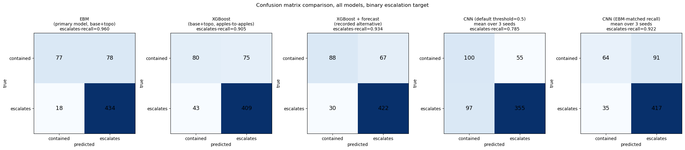

# Flashpoint

Early-state wildfire severity classification: given only the first 1-2 days
of an active fire (extent, weather, cumulative dryness), predict a severity
tier that informs how quickly/heavily to mobilize response -- rather than
waiting for the full trajectory to play out.

Successor to `steam_trajectory`, carrying forward database-first workflow,
gradient boosting + feature analysis, and adding: a second data modality
(early raster stacks), a neural net comparison arm, and an explicit
interpretability comparison (SHAP vs. EBM vs. Grad-CAM).

## Results

Primary task: binary escalation. From the first two days of a fire, predict
whether it stays in the bottom quartile of eventual peak extent
("contained", 155 of 607 events) or grows past it ("escalates", 452).
All numbers use leave-one-year-out (LOYO) cross-validation: train on three
of the four years (2018-2021), test on the fourth, and average over the
four held-out years. Source: `notebooks/03_feature_engineering.ipynb`,
Step 9.

| Model | Accuracy | Macro-F1 | Escalates-recall |
|---|---|---|---|
| EBM (primary) | 0.83 | 0.75 | 0.95 |
| XGBoost, same features | 0.79 | 0.72 | 0.88 |
| XGBoost + GFS forecast features | 0.82 | 0.76 | 0.91 |
| Majority class (always "escalates") | 0.73 | 0.42 | 1.00 |

"Same features" means the EBM's 15 features: fire extent, observed weather,
drought and fire-danger indices, and topography over the first two days.
The GFS forecast features are real weather forecasts, not observed or
reanalysis weather: aggregates of the NOAA GFS run issued at 00 UTC on the
last window day, so they are available at prediction time.

Macro-F1 is the headline metric because escalation is the majority class
(~75% of events): the baseline reaches 0.73 accuracy without ever
identifying a contained fire. Escalates-recall is reported separately
because a missed escalation costs more than a false alarm, which is why the
EBM stays primary even though XGBoost with forecast features has slightly
higher macro-F1.

Secondary: on the 4-class quartile tiers, XGBoost reaches 0.46 LOYO
accuracy against 0.25 chance. Most of that error is between adjacent tiers.



Pooled out-of-fold confusion matrices over all 607 events
(`notebooks/06_results_summary.ipynb`). The recall in each panel title is
pooled, so it differs slightly from the per-year mean in the table (EBM
0.960 vs. 0.953). The two CNN panels are the raster-CNN comparison from
`notebooks/05_cnn_severity.ipynb`. When its threshold is lowered to bring
recall near the EBM's, it produces more false alarms than the EBM.

### Limitations

Severity labels come from peak single-day fire extent. Peak extent and
cumulative footprint (the union of fire pixels over the whole trajectory)
are strongly related (Pearson r = 0.850, Spearman r = 0.949), but 159/607
events (26.2%) would land in a different severity tier if labeled by
cumulative footprint instead of peak extent. Peak extent is a defensible
severity basis, not the only one (`notebooks/06_results_summary.ipynb`,
Step 2).

## Data

[WildfireSpreadTS](https://doi.org/10.5281/zenodo.8006177) (Gerard et al.,
2023) -- 607 full US wildfire event trajectories, 2018-2021, 23 channels
(active fire, weather, fuel, topography) at 24hr resolution. ~50GB of
GeoTIFFs, CC-BY-4.0, converted locally to HDF5 (~92GB) via the authors' own
`CreateHDF5Dataset.py` for fast repeated reads. Both live outside Dropbox
and outside Time Machine's scope (`~/ml_datasets/flashpoint/`) -- large,
reproducible, not worth syncing or backing up.

## Setup

**Install everything numerically-compiled via conda-forge first, then let
pip fill in the pure-Python rest.** Mixing pip and conda for packages like
numpy/xgboost/scikit-learn is what caused most of this project's setup pain
(ABI mismatches, phantom "already satisfied" states, `conda uninstall`
cascading and removing unrelated packages) -- conda-forge keeps their
binaries mutually compatible; pip doesn't know or care.

```bash
conda create -n flashpoint python=3.11 -y
conda activate flashpoint
conda install -c conda-forge "numpy<2.4" xgboost scikit-learn scipy pandas matplotlib -y
pip install -e ".[dev]" --no-deps
```

`--no-deps` on the last line is deliberate -- it installs the `flashpoint`
package itself without pip trying to also resolve numpy/xgboost/etc. and
potentially reinstalling incompatible versions on top of the conda ones.
After this, install the remaining packages. The pure-Python ones have no
compiled-binary conflicts, so plain pip is fine for them specifically;
cartopy has GEOS/PROJ dependencies, so it comes from conda-forge:

```bash
pip install duckdb h5py interpret-core shap tqdm jupyter ipykernel pytest
conda install -c conda-forge cartopy -y   # only for the maps in notebook 02
```

The CNN notebook (05) runs in a second environment, `flashpoint_mps`.
[SETUP.md](SETUP.md) covers that environment, how to recover a broken
install, and macOS-specific pitfalls.

## Plan

1. **Data & database** -- stage the archive, convert to HDF5, build the
   DuckDB manifest, derive severity labels from full trajectories
   (peak active-fire extent, not last-day extent -- see
   `01_data_ingestion.ipynb` for why). *Done.*
2. **Feature engineering & GBM/EBM baseline** -- early-window tabular
   features (`03_feature_engineering.ipynb`), XGBoost + SHAP, and an
   Explainable Boosting Machine as a fully-transparent second baseline.
   *Done.* Topography features help (~+5pp); vegetation features don't.
   The EBM is the primary model because it has the highest
   escalates-recall. XGBoost with GFS forecast features has the highest
   macro-F1, and XGBoost leads on the secondary 4-class target. Adding the
   forecast features did not help the EBM (macro-F1 0.754 -> 0.748), so its
   reported feature set is unchanged. Numbers are in [Results](#results);
   the full iteration history is in notebook 03.
3. **Neural net exploration** -- a small CNN on early raster stacks,
   predicting the same binary label, with Grad-CAM for the CNN. *Done*
   (notebooks 05 and 06): at recall comparable to the EBM's, the CNN
   produces more false alarms, so it isn't an improvement over the tabular
   models. The planned tabular MLP sanity check was deferred
   (`docs/cnn_plan.md`).
4. **Stretch: next-day spread prediction** -- single-step U-Net as an
   explicit "future work" extension, not the core deliverable.

## Structure

```
src/flashpoint/
    data_access.py   # HDF5 discovery + reading (channel order, pixel area)
    db.py            # DuckDB schema (events, event_outcomes, early_features)
    labels.py        # severity tier derivation (peak extent across trajectory)
    features.py      # early-window tabular feature engineering
    evaluation.py    # leave-one-year-out CV used by every reported result
    rasters.py       # fixed-size early-window raster crops for the CNN arm
    cnn.py           # small CNN + Grad-CAM on early-window raster crops
notebooks/
    01_data_ingestion.ipynb       # DB build + severity labels
    02_early_exploration.ipynb    # trajectories, geography, active-fire evolution
    03_feature_engineering.ipynb  # early features + GBM/EBM baselines
    04_feature_diagnostics.ipynb  # early-feature distributions, correlations, clustering
    05_cnn_severity.ipynb         # CNN + interpretability comparison
    06_results_summary.ipynb      # capstone: model comparison, peak-vs-cumulative extent, narrative
tests/                # pytest suite for the pure functions in labels.py / features.py
data/                # local cache (duckdb file) -- gitignored
```

Run the test suite with `pytest tests/` in the `flashpoint` env (`pytest`
is already a dev dependency, no separate install needed). It covers the
deterministic, no-I/O functions only -- severity binning, active-fire
mask/peak-extent derivation, and the early-window feature aggregation
(NaN-robustness, wind/aspect sin+cos encoding) -- against small synthetic
arrays, not real project data.
